# Домашнее задание к занятию 5. «Elasticsearch»

## Задача 1

В этом задании вы потренируетесь в:

- установке Elasticsearch,
- первоначальном конфигурировании Elasticsearch,
- запуске Elasticsearch в Docker.

Используя Docker-образ [centos:7](https://hub.docker.com/_/centos) как базовый и 
[документацию по установке и запуску Elastcisearch](https://www.elastic.co/guide/en/elasticsearch/reference/current/targz.html):

- составьте Dockerfile-манифест для Elasticsearch,
- соберите Docker-образ и сделайте `push` в ваш docker.io-репозиторий,
- запустите контейнер из получившегося образа и выполните запрос пути `/` c хост-машины.

Требования к `elasticsearch.yml`:

- данные `path` должны сохраняться в `/var/lib`,
- имя ноды должно быть `netology_test`.

В ответе приведите:

- текст Dockerfile-манифеста,
- ссылку на образ в репозитории dockerhub,
- ответ `Elasticsearch` на запрос пути `/` в json-виде.

Подсказки:

- возможно, вам понадобится установка пакета perl-Digest-SHA для корректной работы пакета shasum,
- при сетевых проблемах внимательно изучите кластерные и сетевые настройки в elasticsearch.yml,
- при некоторых проблемах вам поможет Docker-директива ulimit,
- Elasticsearch в логах обычно описывает проблему и пути её решения.

Далее мы будем работать с этим экземпляром Elasticsearch.

**Решение**

Файлы конфигураций
[Dockerfile](Dockerfile)
[elasticsearch.yml](elasticsearch.yml)

Создание образа на основе файла Dockerfile, в качестве контекста используется текущая директория (точка в конце выражения)
Для создание образа пришлось скачать дистрибутив elasticsearch8.7. с помощью vpn, так как доступ к сайту закрыт для РФ. 

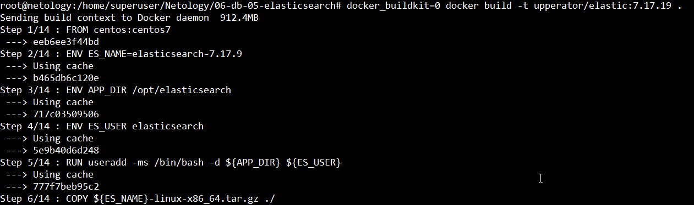

отправляю образ на dockerhub

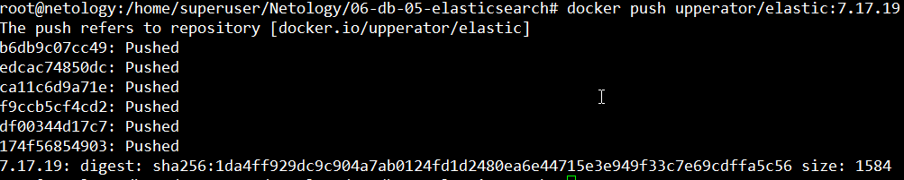

Ссылка на образ в [dockerhub ](https://hub.docker.com/r/upperator/elastic/tags)

Запуск образа

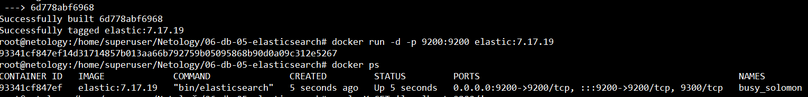

Ответ `Elasticsearch` на запрос пути `/` в json-виде.

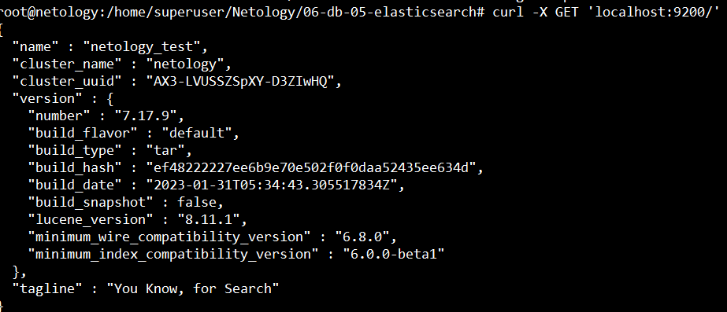


## Задача 2

В этом задании вы научитесь:

- создавать и удалять индексы,
- изучать состояние кластера,
- обосновывать причину деградации доступности данных.

Ознакомьтесь с [документацией](https://www.elastic.co/guide/en/elasticsearch/reference/current/indices-create-index.html) 
и добавьте в `Elasticsearch` 3 индекса в соответствии с таблицей:

| Имя | Количество реплик | Количество шард |
|-----|-------------------|-----------------|
| ind-1| 0 | 1 |
| ind-2 | 1 | 2 |
| ind-3 | 2 | 4 |

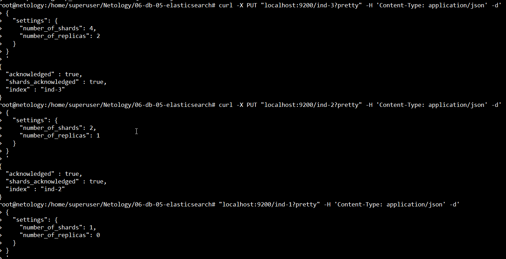

Получите список индексов и их статусов, используя API, и **приведите в ответе** на задание.

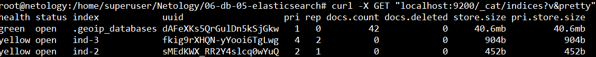

Получите состояние кластера `Elasticsearch`, используя API.

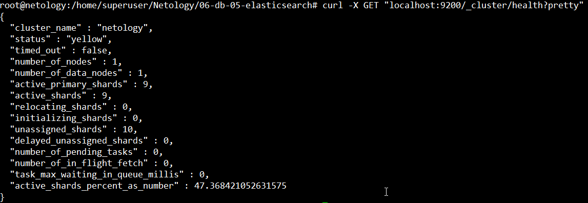

Как вы думаете, почему часть индексов и кластер находятся в состоянии yellow?

`Шарды ожидают ноды для реплики, но так как их нет, они показывают состояние yellow`

Удалите все индексы.

`curl -X DELETE 'http://localhost:9200/_all'`

**Важно**

При проектировании кластера Elasticsearch нужно корректно рассчитывать количество реплик и шард,
иначе возможна потеря данных индексов, вплоть до полной, при деградации системы.



## Задача 3

В этом задании вы научитесь:

- создавать бэкапы данных,
- восстанавливать индексы из бэкапов.

Создайте директорию `{путь до корневой директории с Elasticsearch в образе}/snapshots`.

Создание директории описал в файлах Dockerfile и elasticsearch.yml 

Используя API, [зарегистрируйте](https://www.elastic.co/guide/en/elasticsearch/reference/current/snapshots-register-repository.html#snapshots-register-repository) 
эту директорию как `snapshot repository` c именем `netology_backup`.
**Приведите в ответе** запрос API и результат вызова API для создания репозитория.

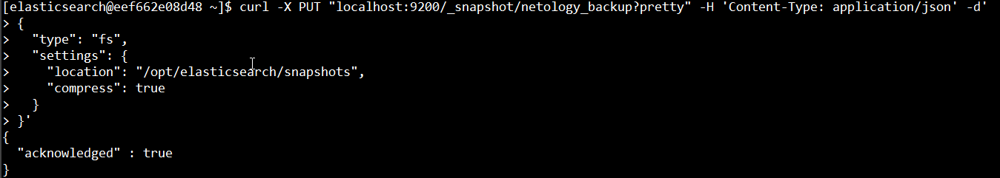

Создайте индекс `test` с 0 реплик и 1 шардом и **приведите в ответе** список индексов.

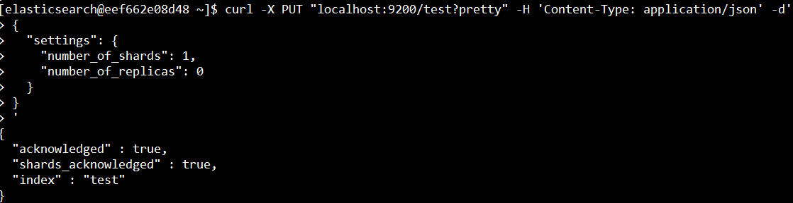
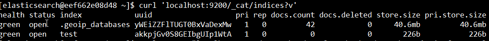

[Создайте `snapshot`](https://www.elastic.co/guide/en/elasticsearch/reference/current/snapshots-take-snapshot.html) 
состояния кластера `Elasticsearch`.
**Приведите в ответе** список файлов в директории со `snapshot`.

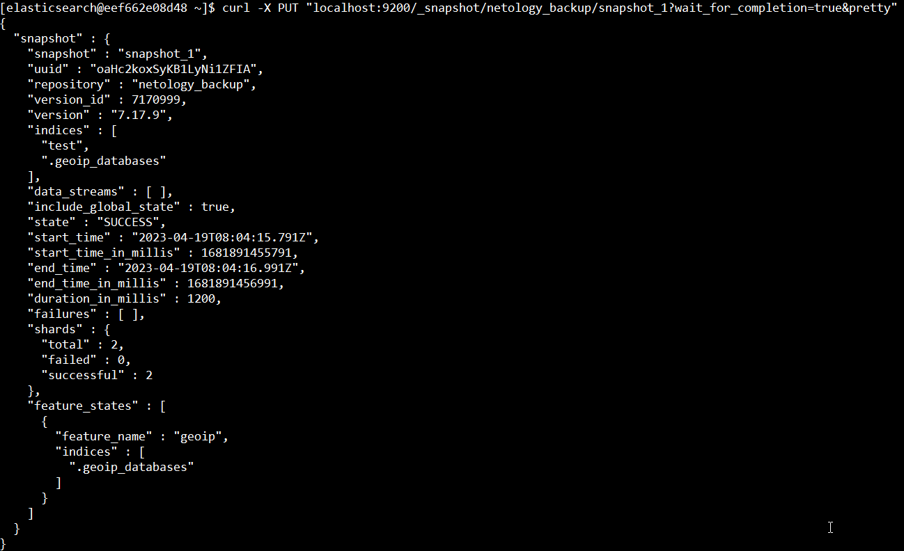

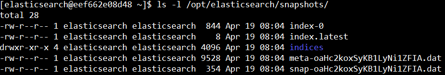

Удалите индекс `test` и создайте индекс `test-2`. 

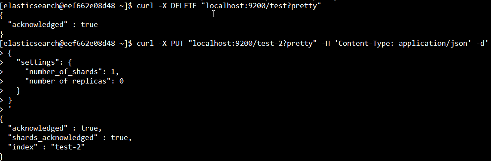

**Приведите в ответе** список индексов.

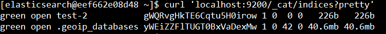


[Восстановите](https://www.elastic.co/guide/en/elasticsearch/reference/current/snapshots-restore-snapshot.html) состояние
кластера `Elasticsearch` из `snapshot`, созданного ранее. 
**Приведите в ответе** запрос к API восстановления и итоговый список индексов.

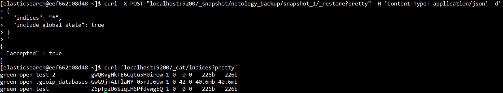

Подсказки:

- возможно, вам понадобится доработать `elasticsearch.yml` в части директивы `path.repo` и перезапустить `Elasticsearch`.

---

### Как cдавать задание

Выполненное домашнее задание пришлите ссылкой на .md-файл в вашем репозитории.

---

