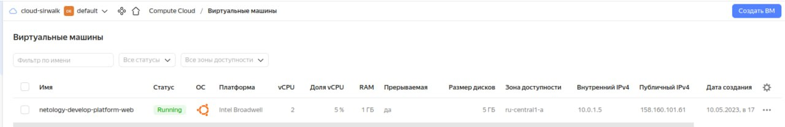
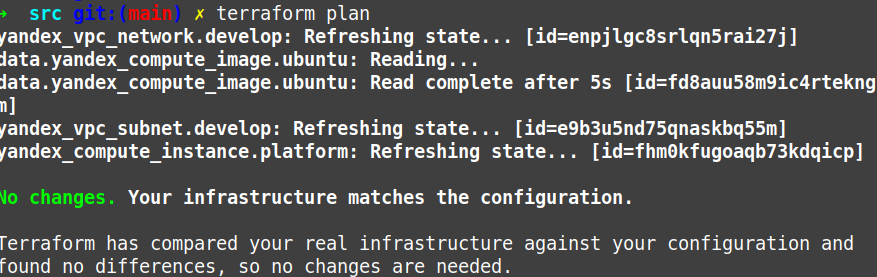
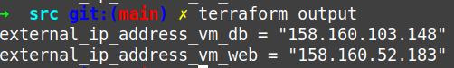

# Домашнее задание к занятию «Основы Terraform. Yandex Cloud»

### Цель задания

1. Создать свои ресурсы в облаке Yandex Cloud с помощью Terraform.
2. Освоить работу с переменными Terraform.


### Чеклист готовности к домашнему заданию

1. Зарегистрирован аккаунт в Yandex Cloud. Использован промокод на грант.
2. Установлен инструмент Yandex Cli.
3. Исходный код для выполнения задания расположен в директории [**02/src**](https://github.com/netology-code/ter-homeworks/tree/main/02/src).


### Задание 0

1. Ознакомьтесь с [документацией к security-groups в Yandex Cloud](https://cloud.yandex.ru/docs/vpc/concepts/security-groups?from=int-console-help-center-or-nav).
2. Запросите preview доступ к данному функционалу в ЛК Yandex Cloud. Обычно его выдают в течении 24-х часов.
https://console.cloud.yandex.ru/folders/<ваш cloud_id>/vpc/security-groups.   
Этот функционал понадобится к следующей лекции. 


### Задание 1

1. Изучите проект. В файле variables.tf объявлены переменные для yandex provider.
2. Переименуйте файл personal.auto.tfvars_example в personal.auto.tfvars. Заполните переменные (идентификаторы облака, токен доступа). Благодаря .gitignore этот файл не попадет в публичный репозиторий. **Вы можете выбрать иной способ безопасно передать секретные данные в terraform.**
3. Сгенерируйте или используйте свой текущий ssh ключ. Запишите его открытую часть в переменную **vms_ssh_root_key**.
4. Инициализируйте проект, выполните код. Исправьте возникшую ошибку. Ответьте в чем заключается ее суть?


`Ошибка при выполнении команды terraform apply`


`Причина ошибки - недопустимое количество ядер для платформы "standart-v1", допустимые цифры 2,4. После исправления параметра машина запустилась`


7. Ответьте, как в процессе обучения могут пригодиться параметры```preemptible = true``` и ```core_fraction=5``` в параметрах ВМ? Ответ в документации Yandex cloud.

`preemptible = true - делает ВМ прерываемой.
core_fraction = 5 - задает уровень производительности процессора ВМ.
Прерываемые виртуальные машины доступны по более низкой цене в сравнении с обычными, однако не обеспечивают отказоустойчивости.
ВМ с уровнем производительности меньше 100% предназначены для запуска приложений, не требующих высокой производительности и не чувствительных к задержкам. Такие машины обойдутся дешевле и пригодятся для обучения.
`

В качестве решения приложите:
- скриншот ЛК Yandex Cloud с созданной ВМ,



- скриншот успешного подключения к консоли ВМ через ssh,


- ответы на вопросы.


### Задание 2

1. Изучите файлы проекта.
2. Замените все "хардкод" **значения** для ресурсов **yandex_compute_image** и **yandex_compute_instance** на **отдельные** переменные. К названиям переменных ВМ добавьте в начало префикс **vm_web_** .  Пример: **vm_web_name**.


3. Объявите нужные переменные в файле variables.tf, обязательно указывайте тип переменной. Заполните их **default** прежними значениями из main.tf.

`Добавил нужные переменные в файле variables.tf`


4. Проверьте terraform plan (изменений быть не должно). 



### Задание 3

1. Создайте в корне проекта файл 'vms_platform.tf' . Перенесите в него все переменные первой ВМ.

Создал файл [vms_platform.tf](src/vms_platform.tf)

2. Скопируйте блок ресурса и создайте с его помощью вторую ВМ(в файле main.tf): **"netology-develop-platform-db"** ,  cores  = 2, memory = 2, core_fraction = 20. Объявите ее переменные с префиксом **vm_db_** в том же файле('vms_platform.tf').

Изменил [main.tf](src/main.tf)

3. Примените изменения.


### Задание 4

1. Объявите в файле outputs.tf отдельные output, для каждой из ВМ с ее внешним IP адресом.

[outputs.tf](src/output.tf)

2. Примените изменения.


3. В качестве решения приложите вывод значений ip-адресов команды ```terraform output```



### Задание 5

1. В файле locals.tf опишите в **одном** local-блоке имя каждой ВМ, используйте интерполяцию ${..} с несколькими переменными по примеру из лекции.

[locals.tf ](src/locals.tf)

2. Замените переменные с именами ВМ из файла variables.tf на созданные вами local переменные.

[variables.tf](src/variables.tf)

4. Примените изменения.


### Задание 6

1. Вместо использования 3-х переменных  ".._cores",".._memory",".._core_fraction" в блоке  resources {...}, объедените их в переменные типа **map** с именами "vm_web_resources" и "vm_db_resources".
2. Так же поступите с блоком **metadata {serial-port-enable, ssh-keys}**, эта переменная должна быть общая для всех ваших ВМ.

Создал файл myssh.tf со значением ssh-key, добавил его в .gitignore


В файле vms_platform.tf добавил переменные


В файле main.tf
 


3. Найдите и удалите все более не используемые переменные проекта.

В файле variables.tf 


В файле vms_platform.tf 


В файле personal.auto.tfvars удалил значение ssh-ключа


4. Проверьте terraform plan (изменений быть не должно).


------

## Дополнительные задания (со звездочкой*)

**Настоятельно рекомендуем выполнять все задания под звёздочкой.**   
Их выполнение поможет глубже разобраться в материале. Задания под звёздочкой дополнительные (необязательные к выполнению) и никак не повлияют на получение вами зачета по этому домашнему заданию. 

### Задание 7*

Изучите содержимое файла console.tf. Откройте terraform console, выполните следующие задания: 

1. Напишите, какой командой можно отобразить **второй** элемент списка test_list?
2. Найдите длину списка test_list с помощью функции length(<имя переменной>).
3. Напишите, какой командой можно отобразить значение ключа admin из map test_map ?
4. Напишите interpolation выражение, результатом которого будет: "John is admin for production server based on OS ubuntu-20-04 with X vcpu, Y ram and Z virtual disks", используйте данные из переменных test_list, test_map, servers и функцию length() для подстановки значений.

В качестве решения предоставьте необходимые команды и их вывод.

------
### Правила приема работы

В git-репозитории, в котором было выполнено задание к занятию "Введение в Terraform", создайте новую ветку terraform-02, закомитьте в эту ветку свой финальный код проекта. Ответы на задания и необходимые скриншоты оформите в md-файле в ветке terraform-02.

В качестве результата прикрепите ссылку на ветку terraform-02 в вашем репозитории.

**ВАЖНО! Удалите все созданные ресурсы**.


### Критерии оценки

Зачёт:

* выполнены все задания;
* ответы даны в развёрнутой форме;
* приложены соответствующие скриншоты и файлы проекта;
* в выполненных заданиях нет противоречий и нарушения логики.

На доработку:

* задание выполнено частично или не выполнено вообще;
* в логике выполнения заданий есть противоречия и существенные недостатки. 