# Домашнее задание к занятию "Введение в Terraform"

### Цель задания

1. Установить и настроить Terrafrom.
2. Научиться использовать готовый код.

------

### Чеклист готовности к домашнему заданию

1. Скачайте и установите актуальную версию **terraform**(не менее 1.3.7). Приложите скриншот вывода команды ```terraform --version```
2. Скачайте на свой ПК данный git репозиторий. Исходный код для выполнения задания расположен в директории **01/src**.
3. Убедитесь, что в вашей ОС установлен docker

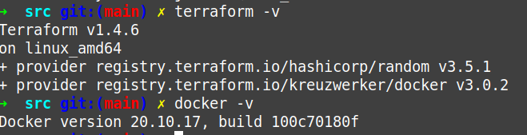

------

### Инструменты и дополнительные материалы, которые пригодятся для выполнения задания

1. Установка и настройка Terraform  [ссылка](https://cloud.yandex.ru/docs/tutorials/infrastructure-management/terraform-quickstart#from-yc-mirror)
2. Зеркало документации Terraform  [ссылка](https://registry.tfpla.net/browse/providers) 
3. Установка docker [ссылка](https://docs.docker.com/engine/install/ubuntu/) 
------

### Задание 1

1. Перейдите в каталог [**src**](https://github.com/netology-code/ter-homeworks/tree/main/01/src). Скачайте все необходимые зависимости, использованные в проекте. 
2. Изучите файл **.gitignore**. В каком terraform файле допустимо сохранить личную, секретную информацию?

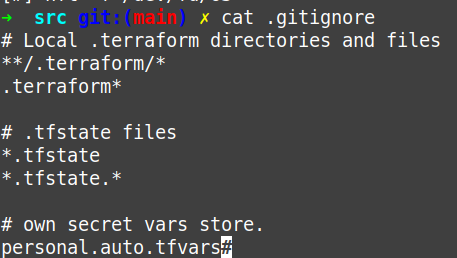

В файле перечислены маски файлов, которые не должны публиковаться в репозитории. Секретная информация хранится в файле `personal.auto.tfvars`

3. Выполните код проекта. Найдите  в State-файле секретное содержимое созданного ресурса **random_password**. Пришлите его в качестве ответа.

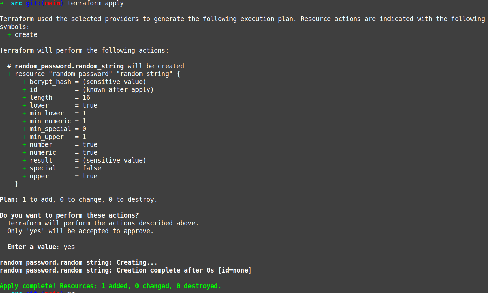

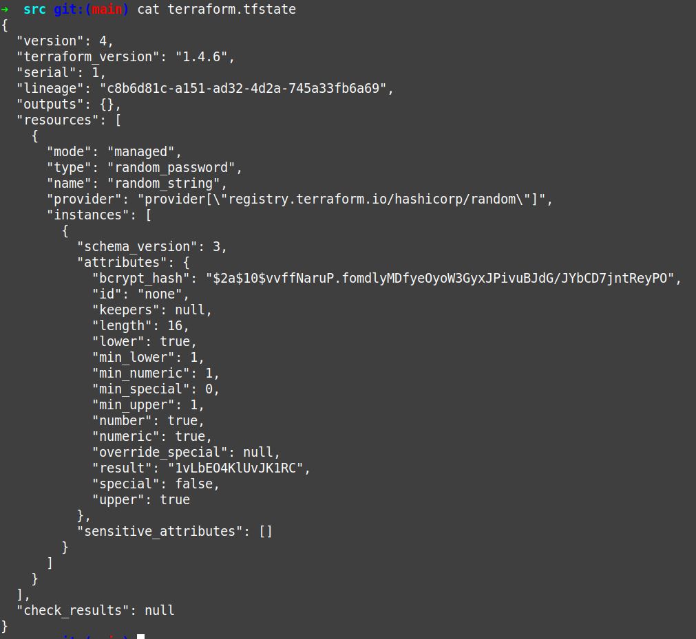

**Случайный пароль видно в строке "result"**

4. Раскомментируйте блок кода, примерно расположенный на строчках 29-42 файла **main.tf**.
Выполните команду ```terraform validate```. Объясните в чем заключаются намеренно допущенные ошибки? Исправьте их.

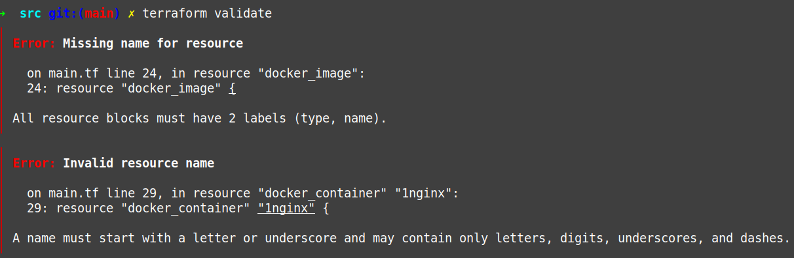

При валидации вылезло две ошибки. 
* Блок ресурса должен содержать два лейбла - тип, имя. 
* Ошибка в имени контейнера. Имя должно начинаться с буквы или подчеркивания, и должно содержать только буквы, цифры, тире.** 

Исправил. Нужно не забыть, что имя ресурса docker_image и image должны совпадать (mydocker)

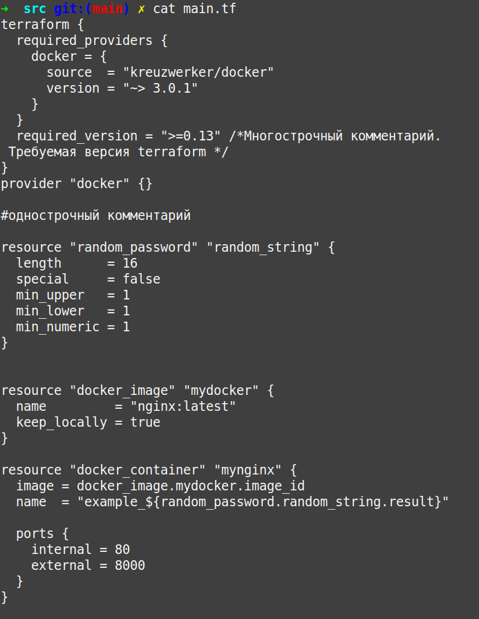

Теперь валидация успешна

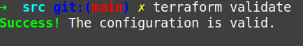
5. Выполните код. В качестве ответа приложите вывод команды ```docker ps```

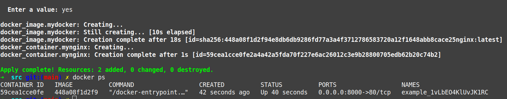

6. Замените имя docker-контейнера в блоке кода на ```hello_world```, выполните команду ```terraform apply -auto-approve```.
Объясните своими словами, в чем может быть опасность применения ключа  ```-auto-approve``` ? 

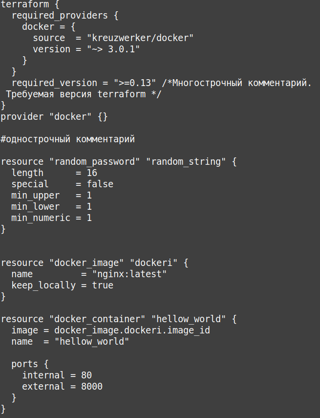

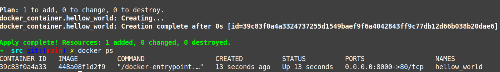

Опасность в том, что ключ  ```-auto-approve``` без предупреждения удалит уже созданный контейнер.

7. Уничтожьте созданные ресурсы с помощью **terraform**. Убедитесь, что все ресурсы удалены. Приложите содержимое файла **terraform.tfstate**. 

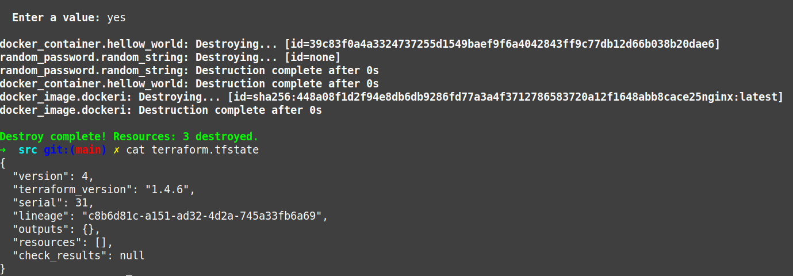

8. Объясните, почему при этом не был удален docker образ **nginx:latest** ?(Ответ найдите в коде проекта или документации)

В конфиге main.tf параметр `keep_locally = true`  сохранят образ локально.  


